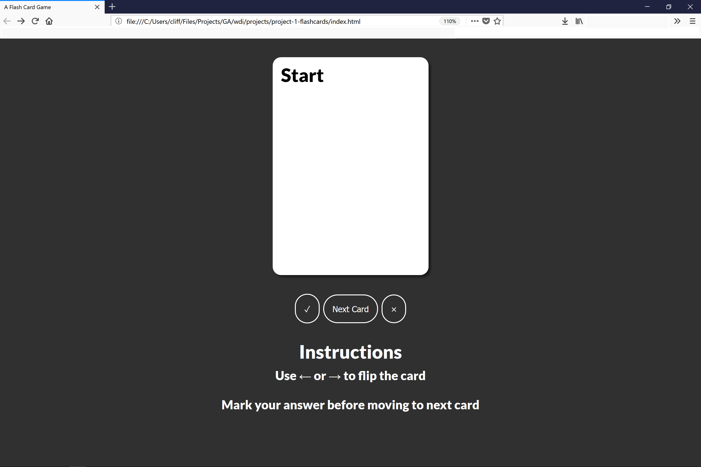

# A Flash Card Game

A simple (for now) flash game. The Game loads flash cards from stored data into session on page load, and presents the player a 'Start' card. The player uses keyboard left or right arrow to flip the card. Player marks a card correct or incorrect. If correct card is removed from the game. If incorrect the card is added back to the stack. Once all card is mark correct, user can reset the game on browser reload. If cards are left in the stack, player can pick up where they left off.

## Motivation

This project has and will continue to be a place where I can practice, test, and experiment with ideas and tools providing a codebase as a jumping off point. 

## Instructions 

Use ← or → to flip the card

Mark your answer before moving to next card

## Screenshots

## Tech/framework used

<b>Built with</b>
- HTML
- CSS
- JS
- jQuery

## Future Plans

#### Known Issues 

- [ ] localStorage for decks might not be the best approach 
- [ ] More user interaction and alerts (current interface isn't  clear. 

#### Features 
- [ ] Track Score over time (and display)
- [ ] Include images on front and back of card
- [ ] User can add cards, save and organize decks

#### Experiments
- [ ]  Design System (8pt grid, probably implement material standards)
- [ ]  Use ES6 Syntax 
- [ ]  More CSS animations!    
- [ ] Sass and BEM
- [ ] Software Architecture

### And the big one

- [ ] Implement Spaced Repetiton System/Algothrim 
      * https://en.wikipedia.org/wiki/Spaced_repetition
